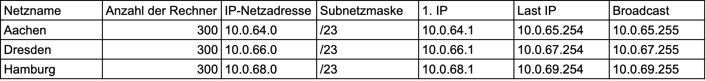
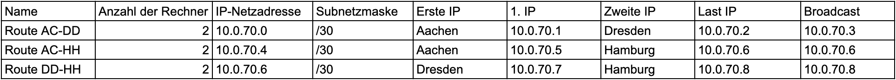

# Aufgabenstellung
Drei Standorte: Aachen, Dresden, Hamburg
Anzahl Hosts: pro Standort 300
Anforderung: 
- VPN
- IPv4 (gleichgroße Netze, möglichst klein)
- IPv6
- Adressbereich: 
    - 10.0.64.0/18 IPv4
    - Global Routing Präfix 2.4711.ACDC

Adressbereiche:
IPv4 (FastEthernet)

IPv4 Verbindungsnetze ohne zusätzlichen Router (Gigabit)

Router bekommen immer die erste verfügbare IP-Adresse im Netzwerk

IPv6
Aachen: 2:4711:ACDC:0:0::/60
Dresden: 2:4711:ACDC:0:1::/60
Hamburg: 2:4711:ACDC:0:2::/60

AC-DD: 2:4711:ACDC:0:3::/60
DD-HH: 2:4711:ACDC:0:4::/60
AC-HH: 2:4711:ACDC:0:5::/60

oder?

Aachen: 2:4711:ACDC:0::/64
Dresden: 2:4711:ACDC:1::/64
Hamburg: 2:4711:ACDC:2::/64

AC-DD: 2:4711:ACDC:3::/64
AC-HH: 2:4711:ACDC:4::/64
DD-HH: 2:4711:ACDC:5::/64

