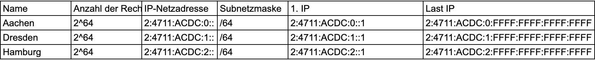

# Aufgabenstellung
Drei Standorte: Aachen, Dresden, Hamburg
Anzahl Hosts: pro Standort 300
Anforderung: 
- VPN
- IPv4 (gleichgroße Netze, möglichst klein)
- IPv6
- Adressbereich: 
    - 10.0.64.0/18 IPv4
    - Global Routing Präfix 2.4711.ACDC

Adressbereiche:
IPv4 (FastEthernet)

IPv4 Verbindungsnetze ohne zusätzlichen Router (Gigabit)

IPv4 Verbindungsnetze mit einem zusätzlichen Router (Gigabit)

IPv6
Aachen: 2.4711.ACDC:0:0:/60
Dresden: 2.4711.ACDC:0:1:/60
Hamburg: 2.4711.ACDC:0:2:/60

AC-DD: 2.4711.ACDC:0:
DD-HH: 2.4711.ACDC:0:
AC-HH: 2.4711.ACDC:0:

AC-Router: 2.4711.ACDC:0:
DD-Router: 2.4711.ACDC:0:
HH-Router: 2.4711.ACDC:0:

