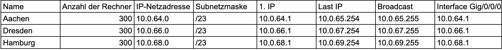
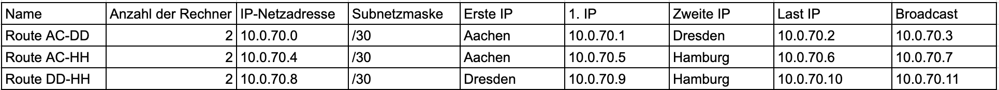
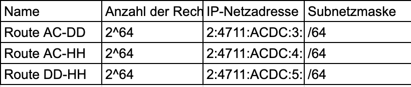

# Aufgabenstellung
Drei Standorte: Aachen, Dresden, Hamburg
Anzahl Hosts: pro Standort 300
Anforderung: 
- VPN
- IPv4 (gleichgroße Netze, möglichst klein)
- IPv6
- Adressbereich: 
    - 10.0.64.0/18 IPv4
    - Global Routing Präfix 2.4711.ACDC

Adressbereiche:
IPv4 (FastEthernet)

IPv4 Verbindungsnetze ohne zusätzlichen Router (Gigabit)

Router bekommen immer die erste verfügbare IP-Adresse im Netzwerk

IPv6 (FastEthernet)

IPv6 Verbindungsnetze ohne zusätzlichen Router (Gigabit)

