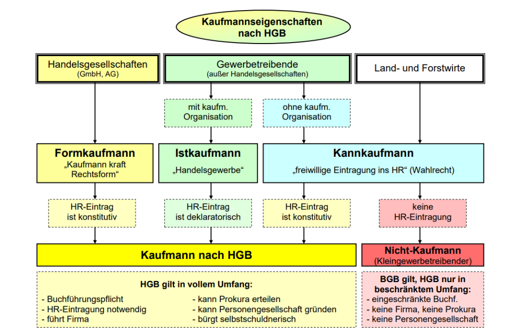

## WUB

>###  Bedrüfniss bedarf nachfrage Bedrüfnisspyramide
   #####  Bedürfniss,Bedarf,Nachfrage 
   Bedürfnisse, Bedarf und Nachfrage stellen die Grundlage der Ökonomie dar und bauen aufeinander auf. Ein Bedürfnis wird zu einem Bedarf, wenn die nötigen finanziellen Mittel für die Befriedigung des Bedürfnisses vorhanden sind. Sobald dann eine konkrete Kaufabsicht geäußert wird, spricht man von Nachfrage.
   #####  Bedürfnispyramide
   Bei der Bedürfnispyramide nach Maslow handelt es sich um eine fünfstufige hierarchisch gegliederte Übersicht der menschlichen Bedürfnisse. Die fünf Bedürfnisstufen bestehen aus (physiologischen) Grundbedürfnissen, Sicherheit, sozialen Bedürfnissen, Individualbedürfnissen sowie Selbstverwirklichung

 

>###  Märkte

| Marktform                  | Anbieter | Nachfrage |
| :-------------------------: | :------: | :-------: |
| Angebots monopol            |  Einer   |  viele    |
| Angebots oligopol           | wenige   |  viele    |
| Nachfrage oligopol          |   Viel   |  Wenige   |
| Nachfrage monopol           |  viele   |  Einer    |
| Zweiseitiges monopol        |  Einer   |  Einer    |
| Zweiseitiges oligopol       | Wenige   |  Wenige   |
| Beschränktes Angebotsmonopol |  Einer  |  Wenige   |
| Beschränktes Nachfragemonopol| Wenige  |  Einer    |
| Polypol                     |  Viele  |  viele    |

 

>### 3. Güter
>

  

> ### 4.  Ökonimisches prinzip
  
|Maximalprinzip|vorhande Mittel|Ziel|Maximaler Erfolg|
|:--------------:|:---------------:|:----:|:---------------:|
|**Minimalprinzip**|**bestimmte Leistung**|**Ziel**|**minmaler Mitteleinsatz**|

Jeder Mensch hat eine große Anzahl von Bedürfnissen : das Bedürfnis nach Brot,
um den Hunger zu stillen; das Bedürfnis nach einer Wohnung oder das Bedürfnis nach einem Auto usw. Die Bedürfnisse des Menschen sind unbegrenzt. Er wird
aber sehr bald feststellen, dass seine Mittel zur Bedürfnisbefriedigung knapp sind.
Dies zwingt den Menschen dazu, mit den vorhandenen Gütern sparsam umzugehen, also zu wirtschaften, so dass er möglichst viele seiner Bedürfnisse befriedigen
kann. Wer so handelt, verfährt nach dem sogenannten wirtschaftlichen oder ökonomischen Prinzip
[..More](./assets/PDF/Ökonomisches%20Prinzip.pdf)
  

> ## 5. Volkommenr/unvolkommener Markt

###   Volkommender Markt
Das Modell des vollkommenen Marktes beschreibt die optimale Marktform, die sich dadurch auszeichnet, dass es so viele Anbietende und Nachfragende auf einem Markt gibt, dass niemand von ihnen Marktmacht besitzt. Es handelt sich allerdings nur um ein Modell, das in der Realität in der Reinform nicht existiert.

[..More](https://www.bpb.de/kurz-knapp/lexika/lexikon-der-wirtschaft/21070/vollkommener-markt/)

   ###  Unvolkommner Markt 
Der unvollkommene Markt taucht in der Praxis häufig auf, denn den vollkommenen Markt gibt es fast ausschließlich in der Theorie. Ein wesentliches Merkmal besteht für unvollkommene Märkte darin, dass dort keine gleichartigen (homogenen) Waren anzutreffen sind. Stattdessen werden auf dem unvollkommenen Markt insbesondere ungleichartige Güter, auch als heterogen bezeichnet, gehandelt. Der Grund besteht darin, dass die einzelnen Waren sich beispielsweise in ihrer Form oder Verpackung voneinander unterscheiden.

Darüber hinaus gibt es auf dem unvollkommenen Markt keine absolute Transparenz und Marktübersicht, wie es bei vollkommenen Märkten der Fall ist. Das ist damit zu begründen, dass sowohl Käufer als auch Verkäufer von Waren nicht im Detail und ohne Ausnahme über sämtliche Konditionen eines Produktes, wie zum Beispiel dessen Qualität oder deren Preise, informiert sind. Zudem werden Angebot und Nachfrage auf unvollkommenen Märkten sowohl auf Verkäufer- als auch auf der Käuferseite beeinflusst, beispielsweise durch individuelle Präferenzen. So bevorzugen vielleicht auch Sie für ein bestimmtes Produkt einen Verkäufer, mit dem Sie schon Jahre gute Erfahrungen gemacht haben, auch wenn ein Produkt des Mitbewerbers vielleicht besser wäre.
[..More](https://www.bpb.de/kurz-knapp/lexika/lexikon-der-wirtschaft/20934/unvollkommener-markt/)

>### 6. Homoekonomikus
#### Klassische Ökonomik
-	Individuen wählen die Verhaltensalternative, die ihren Nutzen maximiert.
-	Individuen primär am eigenen materiellen Vorteil interessiert (aber auch soziale Vorteile)
#### Homo oeconomicus
-	Ökonomisches Handeln aus Zusammenspiel der Eigeninteressen erklärt
-	Rücksichtnahme auf andere Individuen aus rein extrinsischen und strategischen Motiven
-	Kein intrinsisches Interesse der Akteure am Wohlergehen der anderen
-	Aber auch: keine Missgunst, kein Neid, etc.
-	Problematisches Menschenbild, da viele Individuen, wie oben genannt,
 auch auf soziale Aspekte Wert legen und Wohlergehen der anderen interessiert. 

## GVI
> ### 1. Organisationsstrukturen

- #### Hierarchische Organisationsstruktur
  Das pyramidenförmige Organigramm, auf das wir bereits verwiesen haben, wird als hierarchisches Organigramm bezeichnet. Es ist die häufigste Art der Organisationsstruktur – die Befehlskette geht von oben (z. B. vom CEO oder Manager) nach unten (z. B. unerfahrene oder wenig erfahrene Mitarbeiter), wobei jeder Mitarbeiter einen Vorgesetzten hat. 

   - #### Pro  

      - Definiert Zuständigkeits- und Verantwortungsebenen besser
      - Zeigt an, wer wem unterstellt ist oder mit wem über bestimmte Projekte gesprochen werden soll
      - Motiviert Mitarbeitende mit klaren Karrierelaufbahnen und Aufstiegschancen    
      - Teilt jede/m Mitarbeiter/in ein Fachgebiet zu    
      - Schafft Kameradschaft zwischen Mitarbeitenden innerhalb einer Abteilung
   - #### Kontra
      - Kann Innovationen oder wichtige Veränderungen durch zusätzliche Bürokratie verlangsamen
      - Kann dazu führen, dass Mitarbeitende im Interesse der Abteilung statt des Unternehmens als Ganzes handeln
      - Kann wenig erfahrenen Mitarbeitenden das Gefühl geben, dass sie weniger Verantwortung haben und ihre Ideen für das Unternehmen nicht ausdrücken können

- #### Horizontale oder flache Organisationsstruktur
  Eine horizontale oder flache Organisationsstruktur passt zu Unternehmen mit wenigen Ebenen zwischen dem oberen Management und Angestellten auf Mitarbeiterebene. Viele Start-up-Unternehmen verwenden eine horizontale Organisationsstruktur, bevor sie groß genug werden, um verschiedene Abteilungen aufzubauen. Einige Organisationen behalten diese Struktur jedoch bei, da sie weniger Überwachung bedeutet und mehr Beteiligung von Seiten aller Mitarbeitende fördert.

   - #### Pro  

      - Gibt Mitarbeitende mehr Verantwortung
      - Fördert eine offenere Kommunikation   
      - Verbessert Koordination und Geschwindigkeit bei der Implementierung neuer Ideen   
   - #### Kontra

      - Kann Verwirrung stiften, da Mitarbeitende keinem eindeutigen Vorgesetzten unterstellt sind
      - Kann Mitarbeitende mit allgemeineren Fähigkeiten und Kenntnissen hervorbringen
      - Kann schwierig aufrechtzuerhalten sein, wenn das Unternehmen über den Status eines Start-ups hinauswächst

- #### Matrix Organigramm
   Ein Matrix Organigramm sieht aus wie ein Raster und zeigt funktionsübergreifende Teams, die sich für spezielle Projekte bilden. Zum Beispiel kann ein Techniker zur Technikabteilung gehören (die von einem technischen Leiter geführt wird), aber an einem temporären Projekt arbeiten (das von einem Projektmanager geleitet wird). Das Matrix Organigramm berücksichtigt beide Rollen und Vorgesetztenverhältnisse.
  -  #### Pro

      Ermöglicht Vorgesetzten die einfache Auswahl von Personen nach den Anforderungen eines Projekts
      Erlaubt eine dynamischere Sicht auf die Organisation
      Ermutigt Mitarbeitende, ihre Fähigkeiten in verschiedenen Funktionen neben ihrer ursprünglichen Rolle einzusetzen
   - #### Kontra
      Stellt einen Konflikt zwischen Abteilungsleitern und Projektleitern dar
      Kann sich häufiger ändern als andere Arten von Organigrammen
    

   [..Alle Organigramm Formen](https://www.lucidchart.com/blog/de/arten-von-organisations-strukturen)
> ### 2. Firma(Namen)
###### Ein einzutragendes Unternehmen kann zwischen vier verschiedenen Firmenarten wählen:
|Firmenart|	Erläuterung	|Beispiel
|--------|-------------|--------|
|Sachfirma|	Aus der Bezeichnung einer Sachfirma ist der Unternehmenszweck erkennbar.|Tempelhofer Möbelfabrik GmbH|
Personenfirma|	Aus der Bezeichnung einer Personenfirma sind ein oder mehrere Personennamen erkennbar. Dabei ist zu bemerken, dass der Personenname nicht mit dem oder die Inhaber identisch sein muss (z.B kann das Unternehmen gekauft sein und vom neuen Inhaber unter altem Namen fortgeführt werden, siehe auch § 21 und § 22 HGB).	|Alfred Wurm e.Kfm.|
|Fantasiefirma|	Die Bezeichnung der Fantasiefirma stellt einen erdachten Namen dar.	|Learnline GmbH|
|gemischte Firma|	Bei gemischten Firmen können Personennamen, der Unternehmenszweck und Fantasienamen miteinander kombiniert werden.	|Möbelfabrik Wurm e.Kfm.
#### § 19 HGB
(1)	Die Firma muss (...) enthalten:
1	Bei Einzelkaufleuten die Bezeichnung "eingetragener Kaufmann", "eingetragene Kauffrau" oder eine allgemein verständliche Abkürzung dieser Bezeichnung, insbesondere "e. K.", "e. Kfm." oder "e. Kfr.";
2	bei einer offenen Handelsgesellschaft die Bezeichnung "offene Handelsgesellschaft" oder eine allgemein verständliche Abkürzung dieser Bezeichnung;
3	bei einer Kommanditgesellschaft die Bezeichnung "Kommanditgesellschaft" oder eine allgemein verständliche Abkürzung dieser Bezeichnung.
|Rechtsformen|Rechtsformzusatz|
|------------|----------------|
|Eingetragener Kaufmann|	e. K., e. Kfm., e. Kfr.|
|Offene Handelsgesellschaft|	OHG|
|Kommanditgesellschaft|	KG|
|Gesellschaft mit beschränkter Haftung|	GmbH|
|Aktiengesellschaft|	AG|

[..More](https://www.lernnetz24.de/bwl/hinweise/92.html)
>### 3. Handelsregister
Die Eintragungen in das Handelsregister sind zum einen

deklaratorisch, d.h. sie informieren z.B. darüber, dass Herr Alfons Meier seit 1. Februar Prokurist der Firma ist (die Prokura gilt aber bereits, wenn der Kaufmann sie erteilt hat); zum anderen sind sie
konstitutiv, d.h. die Eintragung in das Handelsregister führt erst zu einer Rechtswirkung. Beispiel: eine Aktiengesellschaft entsteht als rechtsfähige juristische Person erst mit der nach § 36 AktG geforderten Eintragung in das Handelsregister

### 4. Rechtsformen
<table>
  <thead>
    <tr>
      <th>Rechtsform</th>
      <th>Kurzporträt</th>
      <th>Haftung</th>
      <th>Gründungskapital</th>
      <th>Gewinn&Verlust Verteilung</th>
      <th>Geschäftsführung & Vertretung</th>
      <th>Gründungskosten</th>
      <th>Finanzierung</th>
    </tr>
  </thead>
  <tbody>
    <tr>
      <td>Einzelunternehmen</td>
      <td>Die Einzelunternehmung ist die häufigste Rechtsform in Deutschland. Das Unternehmen wird von einem einzelnen Inhaber geführt und vertreten.</td>
      <td>Der Inhaber haftet mit privatem und betrieblichem Vermögen.</td>
      <td>Nicht erforderlich</td>
      <td>Der Inhaber erhält den gesamten Gewinn, muss aber auch den gesamten Verlust selbst tragen.</td>
      <td>
        <table>
          <tr>
            <td><strong>Innenverhältnis:</strong> Geschäftsführung durch den Inhaber</td>
            <td><strong>Außenverhältnis:</strong> Vertretung durch den Inhaber</td>
          </tr>
        </table>
      </td>
      <td>Kosten für die Gewerbeanmeldung und ggf. Eintragung ins Handelsregister.</td>
      <td><strong>Eigenfinanzierung:</strong> nur ein Eigentümer <strong>Fremdfinanzierung:</strong> durch hohe Kreditwürdigkeit gute Finanzierungsmöglichkeiten</td>
    </tr>
    <tr>
      <td>Offene HandelsGesellschaft (Personengesellschaft)</td>
      <td>Die OHG besteht aus mindestens zwei Gesellschaftern, die gemeinsam ein Handelsgewerbe betreiben.</td>
      <td>Alle Gesellschafter haften unbeschränkt mit privatem und betrieblichem Vermögen.</td>
      <td>Nicht erforderlich</td>
      <td>Jeder Gesellschafter erhält 4% Zinsen auf seine Kapitalanteile als Gewinn; der Restgewinn und die Verluste werden gleichmäßig nach Köpfen verteilt.</td>
      <td>
        <table>
          <tr>
            <td><strong>Innenverhältnis:</strong> Geschäftsführung durch alle Gesellschafter oder durch einen oder mehrere bestimmte Gesellschafter, wenn im Gesellschaftsvertrag vereinbart</td>
            <td><strong>Außenverhältnis:</strong> Vertretung durch alle Gesellschafter oder durch einen oder mehrere bestimmte Gesellschafter, wenn im Gesellschaftsvertrag vereinbart; Einschränkungen des Finanzrahmens bei der Vertretung sind nach außen unwirksam</td>
          </tr>
        </table>
      </td>
      <td>Kosten für die Gewerbeanmeldung und Eintragung ins Handelsregister, außerdem Notarkosten, falls ein Gesellschafter ein Grundstück einbringt.</td>
      <td><strong>Eigenfinanzierung:</strong> mehrere Gesellschafter <strong>Fremdfinanzierung:</strong> durch hohe Kreditwürdigkeit gute Finanzierungsmöglichkeiten</td>
    </tr>
    <tr>
      <td>Kommanditgesellschaft (Personengesellschaft)</td>
      <td>Mindestens ein vollhaftender Gesellschafter (Komplementär) und ein teilhaftender Gesellschafter (Kommanditist) betreiben gemeinsam ein Handelsgewerbe.</td>
      <td>Der Komplementär haftet mit privatem und betrieblichem Vermögen; der Kommanditist haftet nur mit seiner betrieblichen Kapitaleinlage.</td>
      <td>Nicht erforderlich</td>
      <td>Jeder Gesellschafter erhält vier Prozent Zinsen auf seine Kapitalanteile als Gewinn; der Restgewinn und die Verluste werden in einem angemessenen Verhältnis verteilt.</td>
      <td>
        <table>
          <tr>
            <td><strong>Innenverhältnis:</strong> Geschäftsführung durch den Komplementär; Kommanditist hat nur bei außerordentlichen Geschäften ein Widerspruchsrecht</td>
            <td><strong>Außenverhältnis:</strong> Vertretung ausschließlich durch den Komplementär</td>
          </tr>
        </table>
      </td>
      <td>Kosten für die Gewerbeanmeldung und Eintragung ins Handelsregister, außerdem Notarkosten, falls ein Gesellschafter ein Grundstück einbringt.</td>
      <td><strong>Eigenfinanzierung:</strong> mehrere Gesellschafter, einfachere Suche von weiteren Gesellschaftern als teilhaftende Kommanditisten <strong>Fremdfinanzierung:</strong> durch hohe Kreditwürdigkeit gute Finanzierungsmöglichkeiten</td>
    </tr>
    <tr>
      <td>Gesellschaft mit beschränkter Haftung (Kapitalgesellschaft)</td>
      <td>Ein Unternehmen aus mehreren Gesellschaftern, das bei der Haftung auf das betriebliche Vermögen beschränkt ist.</td>
      <td>Die GmbH haftet als eigene Rechtspersönlichkeit ausschließlich mit dem betrieblichen Vermögen, dem sogenannten Gesellschaftsvermögen. 
        Ausnahme: Vor der Eintragung ins Handelsregister haften die Gesellschafter persönlich und solidarisch.</td>
      <td>25.000 €</td>
      <td>Der Gewinn wird entsprechend ihrer Kapitalanteile auf die Gesellschafter verteilt; der Verlust mindert das betriebliche Eigenkapital, wird aber nicht auf die Gesellschafter verteilt.</td>
      <td>
        <table>
          <tr>
            <td><strong>Innenverhältnis:</strong> Geschäftsführung durch einzelne oder gemeinsam durch mehrere Gesellschafter</td>
            <td><strong>Außenverhältnis:</strong> Vertretung durch den alleinigen Geschäftsführer oder gemeinsam durch mehrere Geschäftsführer; mögliche und rechtlich wirksame Einzelvertretung, wenn im Handelsregister eingetragen</td>
          </tr>
        </table>
      </td>
      <td>Notarkosten für die Beurkundung des Gesellschaftsvertrags, abhängig von der Höhe und der Zusammensetzung des Gründungskapitals, Kosten für die Gewerbeanmeldung und Eintragung ins Handelsregister.</td>
      <td><strong>Eigenfinanzierung:</strong> mehrere Gesellschafter, neue Gesellschafter leichter zu finden; <strong>Fremdfinanzierung:</strong> geringere Kreditwürdigkeit durch Haftungsbeschränkung</td>
    </tr>
    <tr>
      <td>Aktiengesellschaft (Kapitalgesellschaft)</td>
      <td>Ein Unternehmen, dessen Gesellschaftsvermögen auf mehrere Gesellschafter – die sogenannten Aktionäre – verteilt ist und dessen Haftung auf das Gesellschaftsvermögen beschränkt ist.</td>
      <td>Die AG haftet als eigene Rechtspersönlichkeit ausschließlich mit dem betrieblichen Vermögen, dem sogenannten Gesellschaftsvermögen. 
        Ausnahme: Vor der Eintragung ins Handelsregister haften die Gesellschafter persönlich und solidarisch.</td>
      <td>50.000 €</td>
      <td>Der Gewinn wird auf die Aktionäre entsprechend ihrer Anteile verteilt; der Verlust mindert das betriebliche Eigenkapital, wird aber nicht auf die Aktionäre verteilt.</td>
      <td>
        <table>
          <tr>
            <td><strong>Innenverhältnis:</strong> Geschäftsführung gemeinsam durch die Vorstände</td>
            <td><strong>Außenverhältnis:</strong> Vertretung gemeinsam durch die Vorstände; mögliche Einzelvertretung, wenn im Handelsregister eingetragen</td>
          </tr>
        </table>
      </td>
      <td>Hohe Notarkosten für die Beurkundung des Gesellschaftsvertrags, Kosten für die Gewerbeanmeldung und Eintragung ins Handelsregister.</td>
      <td><strong>Eigenfinanzierung:</strong> durch Ausgabe von Aktien sehr gute Eigenfinanzierungsmöglichkeiten, die jedoch mit Kosten verbunden sind; <strong>Fremdfinanzierung:</strong> geringere Kreditwürdigkeit durch Haftungsbeschränkung</td>
    </tr>
      </tbody>
</table>

> ### 5. Berechnung alle rechtsformen(Gewinn Verlust Rechnung)
#### KG beispiel
##### Gewinnverteilung
Im ersten Schritt erhalten alle Gesellschafter:innen 4 % ihres Kapitalanteils als verzinste Auszahlung.
|Gesellschafter|Höhe der Einlagen|Verzinsung 4%|
|--------------|-----------------|-------------|
|Komplementär|50.000 €|2.000 €|
|Kommanditistin 1|150.000 €|6.000 €|
|Kommanditistin 2|300.000 €|12.000 €|

Nach Abzug dieser Anteile verbleibt ein Restgewinn in Höhe von 180.000 €. Von diesem Gewinn wird im zweiten Schritt das Jahresgehalt des Komplementärs in Höhe von 120.000 € abgezogen.

Dann werden die verbleibenden 60.000 € entsprechend der Anteile an der Summe der Einlagen der Gesellschafter:innen verteil
|Gesellschafter:innen|Einlage	|Gewinnanteil	|Verzinsung der Einlage	|Gewinnanteil gesamt|
|--------------------|--------|--------------|-----------------------|-------------------|
|Komplementär|10 %|6.000 €|2.000 €|8.000 €|
|Kommanditistin 1|30%|18.000€|6.000€|24.000€|
|Kommanditistin 2|60 %|36.000 €|12.000 €|48.000 €|

##### Verlustverteilung
Ebenso wir die Gewinne, werden die erlittenen Verluste zunächst in Höhe von 4 % der Kapitaleinlage der Gesellschafter:innen verteilt – sofern keine abweichende Regelung im Gesellschaftsvertrag festgelegt wurde.
Während der Komplementär oder die Komplementärin unbeschränkt auch mit Privatvermögen für die Anteil am Verlust der KG haftet, ist die Haftung der Kommanditist:innen allerdings auf die Höhe ihrer Einlagen beschränkt.
#### OHG
##### Gewinn
Gehen wir beispielhaft davon aus, dass die OHG einen Jahresgewinn von 90.000 € erwirtschaftet hat. Der Gewinn der OHG wird gemäß den Vorgaben des Handelsgesetzbuches unter vier Gesellschafter:innen aufgeteilt.

- Zunächst wird der Gewinnanteil der Gesellschafter:innen in Höhe von 4 % ihrer Kapitaleinlage am Jahresgewinn ermittelt.
- Nach Abzug dieser Gewinnanteile verbleibt ein Restgewinn in Höhe von 70.000 €, der zu gleichen Anteilen auf die Gesellschafter:innen verteilt wird.
-Einlagenerhöhungen und Privatentnahmen beeinflussen die Höhe des Kapitalanteils der Gesellschafter:innen und werden bei der Berechnung entsprechend berücksichtigt.

|Gesellschafter|	Einlage	|Gewinnanteil (4 %)|	Aufteilung Restgewinn|	Gewinnanteil gesamt|
|--------------|-----------|-----------------|-----------------------|---------------------|
|Gesellschafter 1|50.000 €|2.000 €|17.500 €|19.500 €|
|Gesellschafter 2|50.000 €|2.000 €|17.500 €|19.500 €|
|Gesellschafter 3|100.000 €|4.000 €|17.500 €|21.500 €|
|Gesellschafter 4|300.000 €|12.000 €|17.500 €|29.500 €|

##### Verlust
Erwirtschaftet die OHG in einem Geschäftsjahr keine Gewinne, wird der Verlust nach Köpfen auf die Gesellschafter:innen verteilt (vgl. § 121 Abs. 3 HGB). Die Verzinsung ihrer Kapitaleinlagen entfällt komplett.

Wie die Gewinnverteilung kann auch die Verlustverteilung der OHG individuell im Gesellschaftsvertrag geregelt werden. Denkbar ist eine Verlustbeteiligung im Verhältnis zum Kapitalanteil der Gesellschafter:innen oder eine Mischform, die bei der Berechnung sowohl einen prozentualen Anteil als auch einen Anteil nach Köpfen berücksichtigt.

#### GmbH
##### Gewinn
|Gesellschafter|Kapital am Anfang des Jahres|Anteil|Gesamt gewinn|
|--------------|----------------------------|------|-------------|
|Nadine Neu|10.000€|100|2.000€|
|Harald Hilfsbereit|20.000|200|4.000€|
|Gesamt|30.000€|300|6.000€|

#### AG
Um das Rechenbeispiel zu vereinfachen, wird von Stückaktien ausgegangen, die alle den gleichen Wert besitzen. Neben der Anzahl der Anteile ist für die Berechnung der Gewinnbeteiligung die Dividende entscheidend. Die Dividende ist der Anteil am Bilanzgewinn einer AG, der an die Aktionär:innen ausgeschüttet wird.

Beschließt die Hauptversammlung einer AG eine Dividende in Höhe von 1,50 € je Aktie, erhält eine Aktionärin oder ein Aktionär, die oder der 100 Aktien hält, also einen Gewinnanteil in Höhe von 150 €.
 

> ### 6. Kaufmannseigenschaften (minimal)
