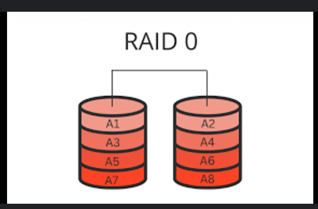
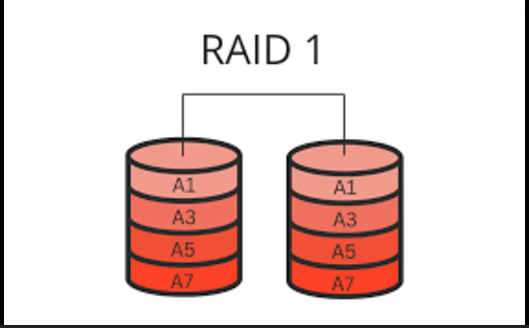
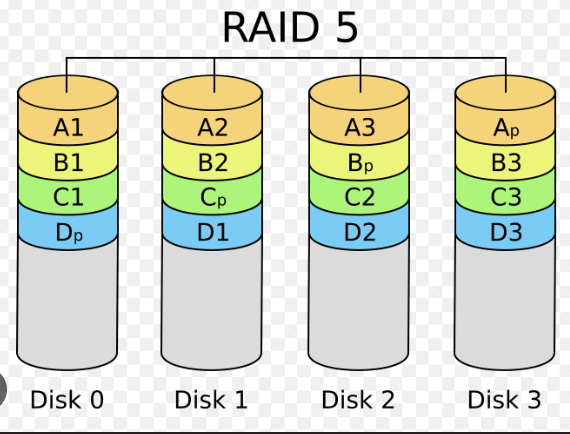
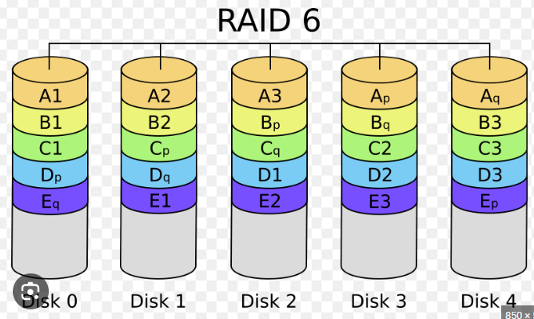
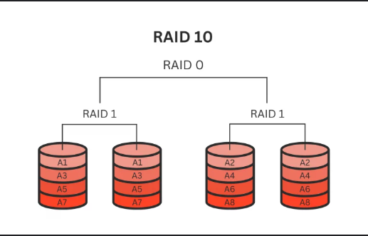
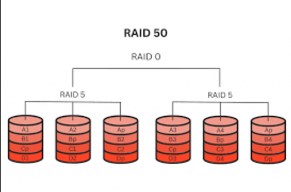
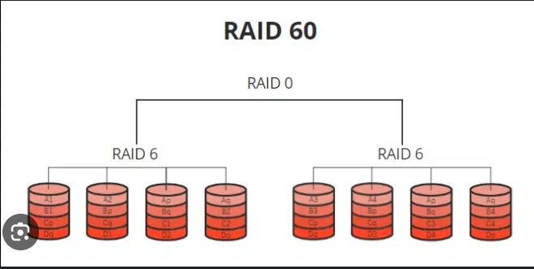
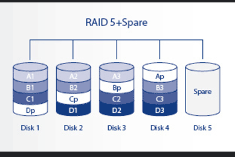

### **RAID 0 (Striping)**

- **Beschreibung**: Daten werden in Blöcke aufgeteilt und abwechselnd über mehrere Festplatten verteilt.
- **Vorteile**:
    - Sehr hohe Schreib- und Lesegeschwindigkeit, da mehrere Festplatten gleichzeitig arbeiten.
    - Maximale Speicherausnutzung.
- **Nachteile**:
    - Keine Datensicherheit – fällt eine Festplatte aus, sind alle Daten verloren.
- **Einsatzgebiet**: Anwendungen, bei denen Geschwindigkeit wichtiger als Datensicherheit ist, z. B. Videobearbeitung.
- 
---

### **RAID 1 (Mirroring)**

- **Beschreibung**: Alle Daten werden 1:1 auf zwei Festplatten gespiegelt.
- **Vorteile**:
    - Hohe Datensicherheit, da eine Kopie der Daten immer verfügbar ist.
    - Lesegeschwindigkeit wird durch parallelen Zugriff erhöht.
- **Nachteile**:
    - Nur die Hälfte des Speicherplatzes ist nutzbar, da alles doppelt gespeichert wird.
- **Einsatzgebiet**: Systeme, bei denen Datensicherheit oberste Priorität hat, z. B. Server.
- 
---

### **RAID 5 (Striping mit Parität)**

- **Beschreibung**: Daten werden auf mindestens 3 Festplatten verteilt, zusammen mit einer Paritätsinformation. Diese Parität ermöglicht die Wiederherstellung von Daten, wenn eine Festplatte ausfällt.
- **Vorteile**:
    - Gute Balance aus Leistung, Speicherplatz und Datensicherheit.
    - Ausfall einer Festplatte tolerierbar.
- **Nachteile**:
    - Schreibgeschwindigkeit langsamer, da Parität berechnet werden muss.
    - Fällt eine Festplatte aus, verringert sich die Leistung während der Wiederherstellung.
- **Einsatzgebiet**: Datenbanken, Datei-Server.
- 
---

### **RAID 6 (Striping mit doppelter Parität)**

- **Beschreibung**: Ähnlich wie RAID 5, aber mit doppelter Parität. Dadurch können zwei Festplatten gleichzeitig ausfallen, ohne Daten zu verlieren.
- **Vorteile**:
    - Höhere Datensicherheit als RAID 5.
    - Geeignet für große Systeme mit vielen Festplatten.
- **Nachteile**:
    - Langsamere Schreibgeschwindigkeit durch aufwändigere Paritätsberechnung.
    - Weniger effektiver Speicherplatz.
- **Einsatzgebiet**: Große Speichersysteme mit hoher Redundanzanforderung.

- 
---

### **RAID 10 (RAID 1 + 0, Mirroring und Striping)**

- **Beschreibung**: Kombination aus RAID 1 (Mirroring) und RAID 0 (Striping). Die Daten werden gespiegelt und gleichzeitig verteilt, benötigt mindestens 4 Festplatten.
- **Vorteile**:
    - Sehr hohe Leistung und Datensicherheit.
    - Ausfall einer Festplatte pro Spiegelpaar tolerierbar.
- **Nachteile**:
    - Effizienz beim Speicherplatz entspricht RAID 1.
    - Höhere Kosten durch doppelte Anzahl an Festplatten.
- **Einsatzgebiet**: Kritische Systeme, die hohe Geschwindigkeit und Redundanz benötigen.
- 
---

### **RAID 50 (RAID 5 + 0)**

- **Beschreibung**: Kombination aus RAID 5 (Parität) und RAID 0 (Striping). Mehrere RAID-5-Gruppen werden miteinander zu einem RAID-0-Verbund kombiniert.
- **Vorteile**:
    - Höhere Leistung als RAID 5 allein.
    - Mehr Redundanz als RAID 0.
- **Nachteile**:
    - Höhere Komplexität.
    - Zwei gleichzeitige Festplattenausfälle in derselben RAID-5-Gruppe können Datenverlust verursachen.
- **Einsatzgebiet**: Große Datenbanken oder Workloads mit hoher Kapazitäts- und Leistungsanforderung.
- 
---

### **RAID 60 (RAID 6 + 0)**

- **Beschreibung**: Kombination aus RAID 6 (doppelte Parität) und RAID 0 (Striping). Mehrere RAID-6-Gruppen werden miteinander kombiniert.
- **Vorteile**:
    - Höchste Redundanz und gute Leistung.
    - Toleriert zwei Festplattenausfälle pro RAID-6-Gruppe.
- **Nachteile**:
    - Weniger effektiver Speicherplatz als RAID 50.
    - Noch höhere Komplexität und Kosten.
- **Einsatzgebiet**: Große, kritische Speichersysteme.
- 
---

### **RAID 5 + Spare**

- **Beschreibung**: Ähnlich wie RAID 5, jedoch mit einer **Hot-Spare-Festplatte**, die im Fall eines Ausfalls automatisch die Rolle der defekten Festplatte übernimmt.
- **Vorteile**:
    - Automatische Wiederherstellung bei Ausfall.
    - Kein manuelles Eingreifen notwendig.
- **Nachteile**:
    - Speicherplatz für die Hot-Spare-Festplatte ist ungenutzt, bis ein Ausfall auftritt.
- **Einsatzgebiet**: Systeme, bei denen eine schnelle Wiederherstellung wichtig ist.
- 
