## Thema: Enity Realtionship

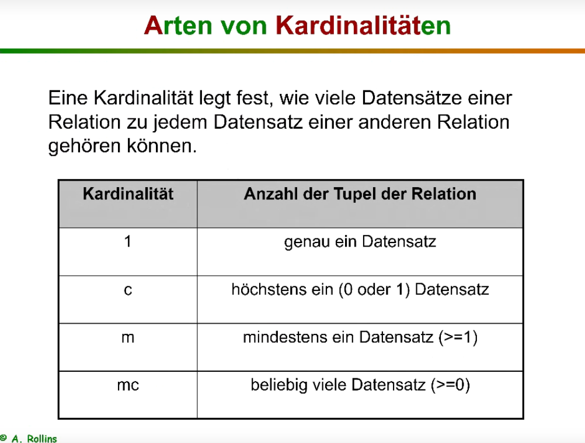

|Kradinalität|Anzal der Tupel der Relation |Beispiel|Zustatz|
|------------|-----------------------------|--|--|
|1 => 1|Genau ein Datenstazt zu Genau ein Datenstazt |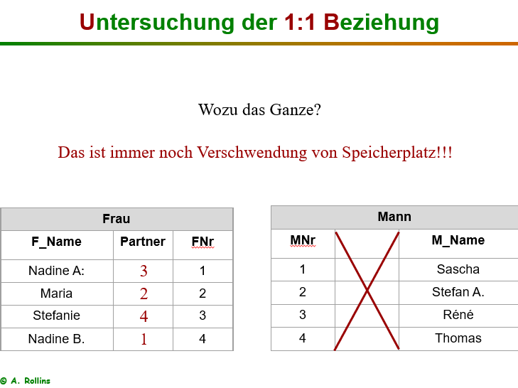|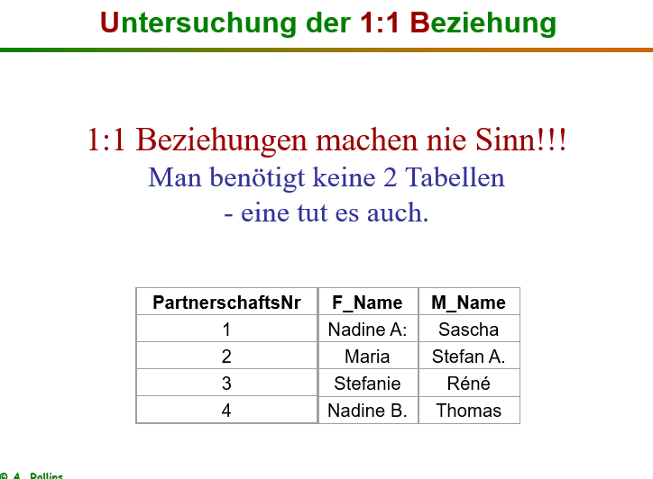|
|1 => c|Genau ein Datenstazt zu hostens 0 oder 1|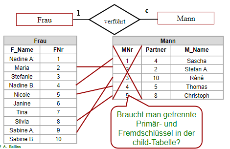 |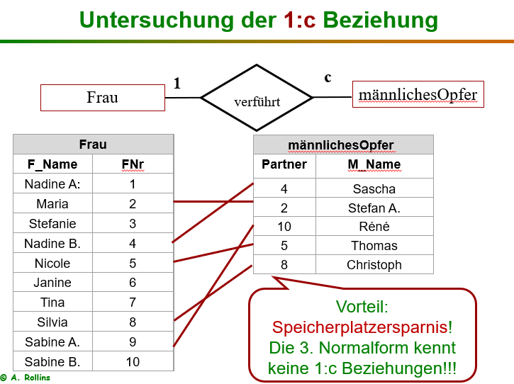|
|1 => m|Genau ein Datenstazt zu mindestens ein Datensatz (>=1) |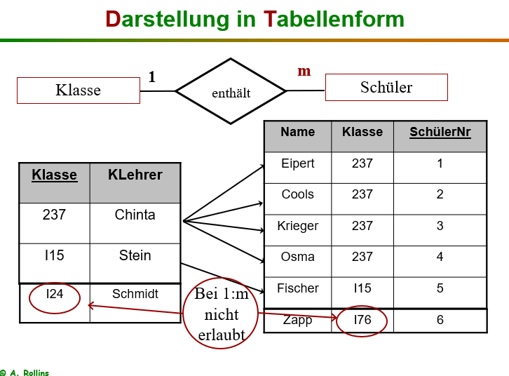 |
|1 => mc|Genau ein Datenstazt zu Belieblig viele Datensatz (>=0) |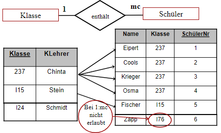 |
|mc => mc|Belieblig viele Datensatz zu Belieblig viele Datensatz (>=0) |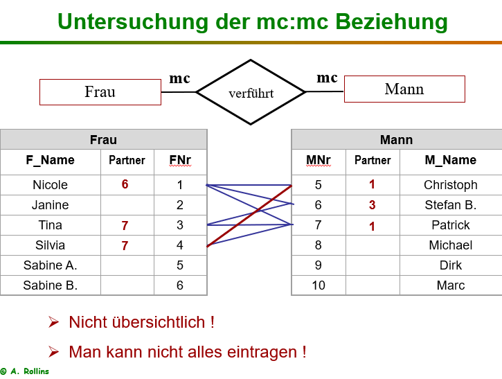 |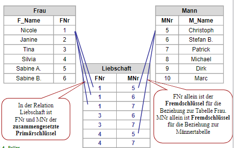|
|c => mc|hostens 0 oder 1 zu Belieblig viele Datensatz (>=0) |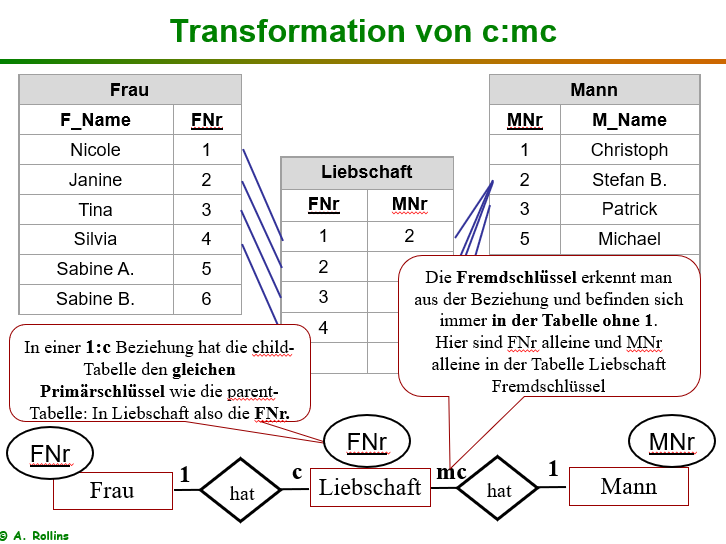|
|1 => mc|Genau 1 Datensatzt zu Belieblig viele Datensatz (>=0) ||

## Fremdschlüssel

### Wo steht der Fremdschlüssel/Foreign Key

* Parent Table kann ohne den anderen Table existieren
* Foreign Keys can be null
* child tables have the foreign key
* **da, wo nicht die 1 steht, ist der Fremdschlüssel**
* das was mehrere Dinge hat, ist Parent, hierarchisch höher

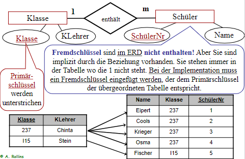

* steht in der Tabelle **ABER** nicht im ERD, da implizit!
- Wenn sich über zwei collums sich ein eindeutiger PK setzten läst dann verwenden wir zwei FK um ein PK zu setzten  dafür mussen aber beide FK in der beiden Tabellen sein
- 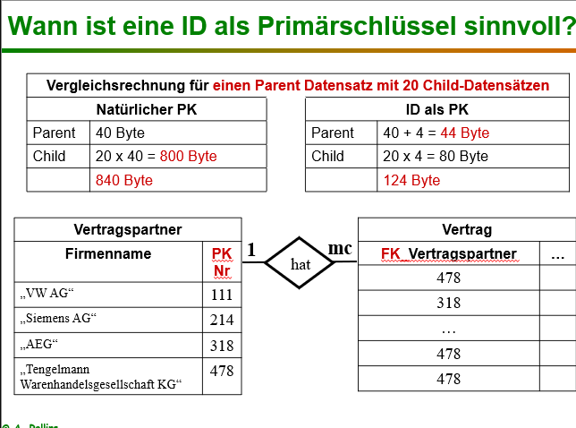

### Transformationen
**Wir Transformieren Wenn Wir Tabellen aufteilen müssen Wegen der 3Normalform**
|Beispiele|
|--|
|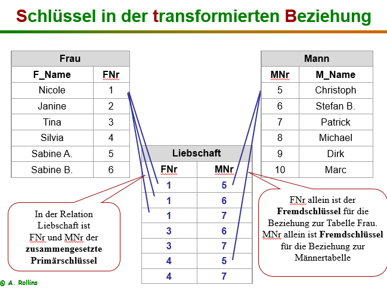|
|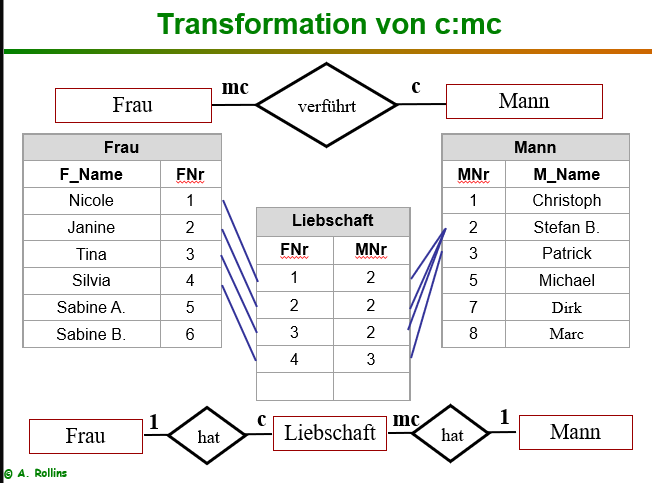|
|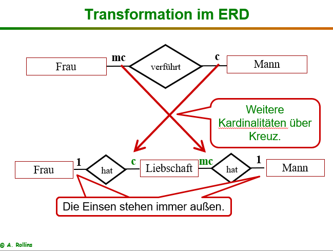|
||

 
>## Beispiele 
>####  *Beachten das in den lösungen nicht alles stimmt*
>#### Otto&Co
>
>
>#### MietWagen
> ##### Aufgabe: 
> - Jeder Mieter erhält eine Mieternummer und wird mit Namen und Anschrift erfasst. 
> - Jedes Fahrzeug wird eindeutig mit einer Fahrzeugnummer identifiziert und mit Baujahr und Erwerbsdatum gespeichert. 
> - Zu den Fahrzeugtypen werden Marke und Modell z.B. Mazda 626 gespeichert. Jeder Typ kann mehrfach in der Firma vorkommen. Z. Bsp. gibt es 5 Mazda 626 und 7 VW Passat. Zu den Marken soll keine separate Entität angelegt werden.
> - Der Mieter kann einen oder mehrere Wagen gleichzeitig nutzen. Auch kommt es vor, dass er bestimmte Wagen, die er schon einmal nutzte, zu einem anderen Termin nochmals mietet. Ein Mieter wird erst beim ersten Vertragsabschluss in die Datenbank aufgenommen.
> - Der Mietpreis richtet sich nach der Mietdauer (Anzahl Tage) und dem Tagespreis des Autos. Stundenweise wird nicht verliehen. Wird eine Änderung der Tagespreise durchgeführt, werden die alten Verträge vorher mit den zugehörigen Daten ins Archiv gelegt und anschließend in der aktuellen Datenbank gelöscht.
> - Der Tagespreis ist abhängig von der Zuordnung eines bestimmten Fahrzeugs zu einer Fahrzeugklasse. So werden z.B. für den Mazda 626 und den VW Passat identische Tagespreise gefordert, da beide der einfachen Mittelklasse zugerechnet werden. Es soll möglich sein, neue Fahrzeugklassen anzulegen, zu denen die Fahrzeuge erst zu einem späteren Zeitpunkt geliefert werden. Auch die Fahrzeugtypen müssen nicht sofort Fahrzeuge enthalten.
> - Die Gesellschaft arbeitet mit mehreren Versicherungsgesellschaften zusammen. Jede Versicherungsgesellschaft, mit der mindestens eine Versicherungspolice abgeschlossen wurde, wird mit einer eindeutigen Nummer, einem Firmennamen und einem Ansprechpartner (Nur Nachname) erfasst. Für jede Fahrzeugklasse wird die günstigste Versicherungsgesellschaft ausgewählt und ein Sammelvertrag abgeschlossen. Alte Verträge werden durch neue ersetzt. Versicherungsgesellschaften ohne Vertrag werden wieder gelöscht. 
>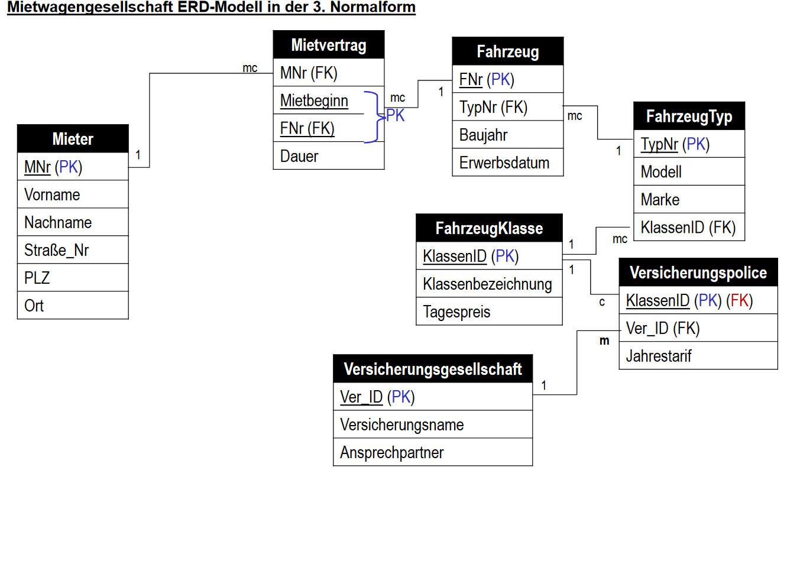
>
>#### Veranstaltung
> ##### Aufgabe: 
> - Jede Person hat einen Namen und eine Adresse. Eine Person kann Teilnehmer oder/und Kursleiter sein. Ein Teilnehmer wird erst dann erfasst, wenn er an mindestens einem Kurs angemeldet ist. Er kann Kurse beliebig oft wiederholen. Zum Teilnehmer wird eine Bonität (Einstufung des Zahlungsverhaltens) erfasst.
>-	Jeder Kursleiter hat auf der Basis einer freiberuflichen Tätigkeit mit dem Bildungsinstitut eine Vereinbarung über die Vergütung pro Unterrichtsstunde ausgehandelt. Ein Kursleiter kann ggf. die unterschiedlichsten Kurse leiten. Hierdurch wird der Stundensatz nicht berührt. Pape erhält pro Schulungsstunde z.B. 80 €, während Habermas nur 70 € nimmt. Ein Kursleiter kann auch an den Kursen anderer Kursleiter teilnehmen – muss dann aber dafür zahlen.
> - Jeder Kurs z.B. „ERD Modellierung“ wird identifiziert durch eine Kursnummer und hat eine Kursbezeichnung mit einer fest zugeordneten Zeitdauer (Tage). Ein Kurs ist eindeutig einem Themengebiet zugeordnet. 
> - Jedes Themengebiet hat einen festen Tagespreis. So beträgt beispielsweise die Kursgebühr für 3 Tage "Arbeitshygiene" in München oder Köln bei Popper oder Habermas 750 €, da das Themengebiet "Sicherheit und Umweltschutz" pro Tag mit 250 € berechnet wird.
> - Ein Kurs kann beliebig oft durchgeführt werden und findet im Schulungszentrum Köln oder München statt. Eine geplante Kursveranstaltung erhält einen Kursbeginn (Datum). Ein Kurs kann im Rahmen der Kapazitäten beliebig oft stattfinden, auch zeitgleich. So fand beispielsweise der Kurs "Einführung in MySQL" am 16.08.1996 in München zweimal statt, geleitet durch Gabbert und Willms. Jeder Kurs hat bei der Durchführung nur einen Kursleiter. Ein Kurs dauert mindestens einen Tag. 
> - Ein Standort hat eine Adresse (Strasse, Hausnr, und Ort genügt) und eine Anzahl Schulungsräume. 
>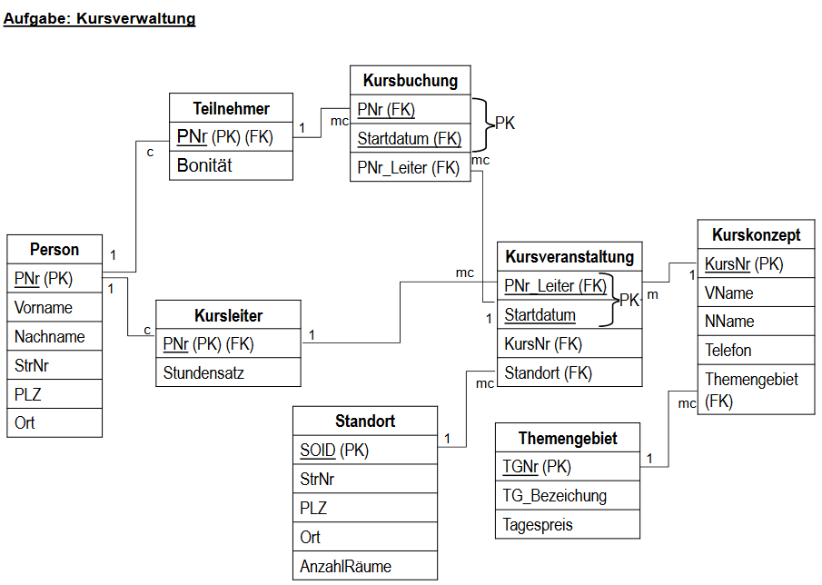

>#### TierPark
> ##### Aufgabe: 
> -	Ein Tier wird identifiziert durch eine eindeutige Nummer und hat einen Namen. Es gehört einer bestimmten Tierart an und befindet sich zum gegenwärtigen Zeitpunkt in einem Gehege. 
> - Jedes Tier erhält ein individuell zusammengestelltes Futter. Dieses Futter setzt sich zusammen aus mehreren Futtersorten. Für jede Futtersorte wird eine genaue Mengenangabe pro Tier (Futterration) und die Frequenz der Fütterungen festgehalten:
> - Beispiel: 
>	- Waschbär „Willi“ bekommt 	täglich 1,5 kg Fleisch und 0,2 kg Gemüse 
>	- Waschbärin „Wanda“ bekommt 	0,3 kg Gemüse pro Tag und 0,4 kg Aufbaufutter 1x pro Woche
>	- Die Eule „Ernestine“ bekommt 	täglich 0,5 kg Fleisch und alle 2 Tage 0,1 kg Vogelaufbaufutter 
>	- Die Schlange „Sally“ bekommt	1 Maus alle 10 Tage.
> - Für jede Futtersorte gibt es eine eindeutige Nummer, eine Futterbezeichnung und eine kurze Beschreibung (z.B. Inhaltsangaben).
> - Für jede Tierart wird eine Nummer vergeben, eine lateinische Artbezeichnung (Genus und Spezies), eine deutsche Artbezeichnung und ein kurzer Infotext festgehalten. Manchmal ist gerade kein Tier der Tierart im Tierpark, da Tiere manchmal auch sterben .
> - In einem Gehege sind in der Regel mehrere Tiere untergebracht und mehrere Tierpfleger zuständig. Jedes Gehege hat einen Namen, z.B. „Wüstenlandschaft“ oder „Affenburg“. Tierpfleger, die keine Gehege pflegen werden sofort entlassen und sind nicht mehr in der Datenbank.
> - Gehege können auch mal leer stehen (Winter, Renovierung, Desinfizierung). Leerstehende Gehege werden nicht geputzt. 
> - Ein Tierpfleger hat einen Namen, eine Personalnummer und eine Telefonnummer.
> - Der Tierpark hat 45 Gehege, aber nur 12 Tierpfleger. 
>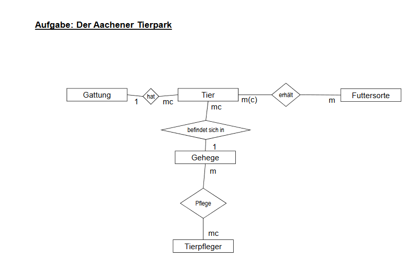
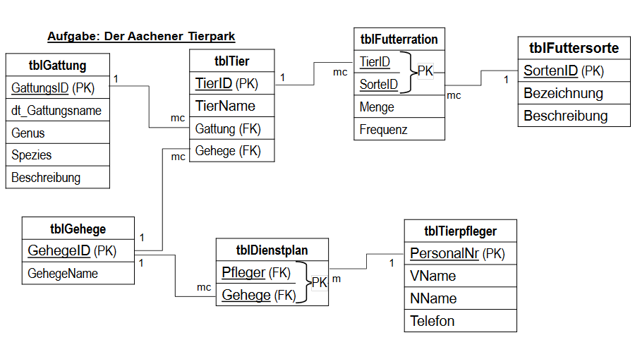