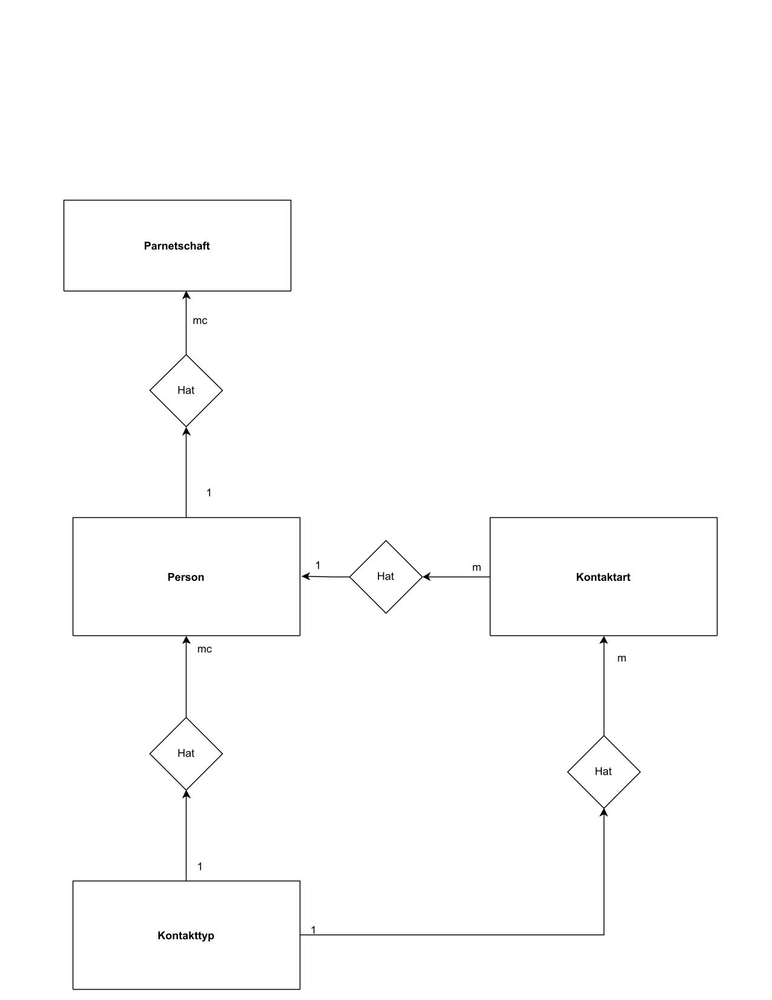

## Thema: Enity Realtionship
|Kradinalität|Anzal der Tupel der Relation |
|------------|-----------------------------|
|1|Genau ein Datenstazt|
|c|höchstens ein (0 oder 1) Datenstatz|
|m|mindestens ein Datensatz (>=1)|
|

#### Otto&Co

#### MietWagen

#### Veranstaltung

#### Partnerschaft

